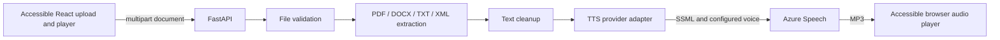

# Soni2

Soni2 turns documents into accessible spoken books. This repository contains the first working vertical slice: upload PDF, EPUB, DOCX, TXT, or XML; extract and clean text; synthesize a Spanish MP3 preview; and listen or download it in the browser.

## Architecture



The frontend is a single focused workflow with semantic controls, a live status region, keyboard visible focus, responsive layout, and reduced motion support. The backend currently exposes `/api/health` and `/api/books/preview`; interactive API documentation is at `/docs`.

## Run locally

1. Copy `.env.example` to `.env` and put your Deepgram key in `DEEPGRAM_API_KEY`. The default endpoint is Deepgram's EU endpoint. Set `DEEPGRAM_MODEL` to an available Aura-2 Spanish voice model.
2. Start the API in one terminal:

   ```powershell
   cd backend
   python -m venv .venv
   .\.venv\Scripts\Activate.ps1
   pip install -r requirements.txt
   uvicorn app.main:app --reload
   ```

3. Start the frontend in another terminal:

   ```powershell
   cd frontend
   npm install
   npm run dev
   ```

Open <http://localhost:5173>. The browser calls `http://localhost:8000` by default; set `VITE_API_URL` to your deployed API origin when hosting separately.

## Docker

After creating `.env` with Azure credentials, run `docker compose up --build` and open <http://localhost:5173>. The API is available on port 8000.

## Configuration

`TTS_PROVIDER` (default `deepgram`; `azure` is also supported), `DEEPGRAM_API_KEY`, `DEEPGRAM_BASE_URL` (default `https://api.eu.deepgram.com`), `DEEPGRAM_MODEL` (default `aura-2-nestor-es`), `TTS_API_KEY`, `TTS_REGION`, `TTS_VOICE`, `TTS_LANGUAGE`, `MAX_UPLOAD_SIZE_MB` (200), and `PREVIEW_CHARACTERS` (5000). Deepgram returns MP3 audio from its Speak REST endpoint. Provider keys are read from environment variables and must not be committed.

## Checks

```powershell
$env:PYTHONPATH='backend'; pytest backend/tests
cd frontend; npm run build
```

CI runs backend tests and the frontend production build on pushes and pull requests.

## Current scope and limitations

- Audio generation is a preview limited to the configured character count, not a persistent full-book audiobook job.
- Internet access and a configured provider key are required to produce audio. The default Deepgram model is a Peninsular Spanish voice; it is male. A female Spain-accent model has not been verified. OCR for scanned PDFs, chapter navigation, resumable jobs, caching, long-form chunk processing, and persisted playback positions are not yet implemented.
- The current default voice is Microsoft's documented standard neural Spanish (Spain) female voice `es-ES-ElviraNeural`; available voices vary by Azure region and subscription.
- Text cleanup is conservative and does not yet infer page headers, footers, or chapter structure.

## Next steps

Add persistent background jobs and a database state machine, provider abstraction with retry and chunk cache, OCR adapter for scanned PDFs, chapter-level MP3 assembly and navigation, and playback position persistence. Then add accessibility interaction tests and deployment hardening.
